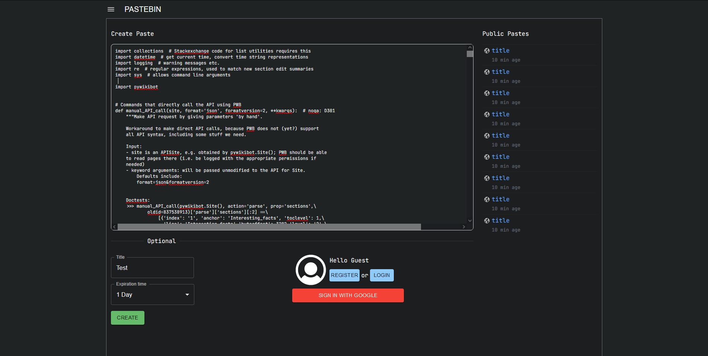

$${\color{red}Work \space In \space Progress}$$

My copy of popular Pastebin (https://pastebin.com/)
<h1>How to run</h1>

Set google api propertis in appsettings.json

<pre>
"GoogleOAuthOptions": {
    "ClientId": "*",
    "ClientSecret": "*"
  },
</pre>

Using docker-compose run the app in Docker

<pre>$ docker-compose up</pre>

You can optionally specify JWT properties

<pre>
"JwtSettings": {
    "Key": "*",
    "HashKey": "*",
    "LifetimeInMinutes": 5,
    "RefreshTokenExpiryTimeInDays" :  7,
    "ValidAudiences": [],
    "ValidIssuers": [],
    "ValidateLifetime": true,
    "ValidateAudience": false,
    "ValidateIssuer": false
  },
</pre>
<h1>Screenshots</h1>

